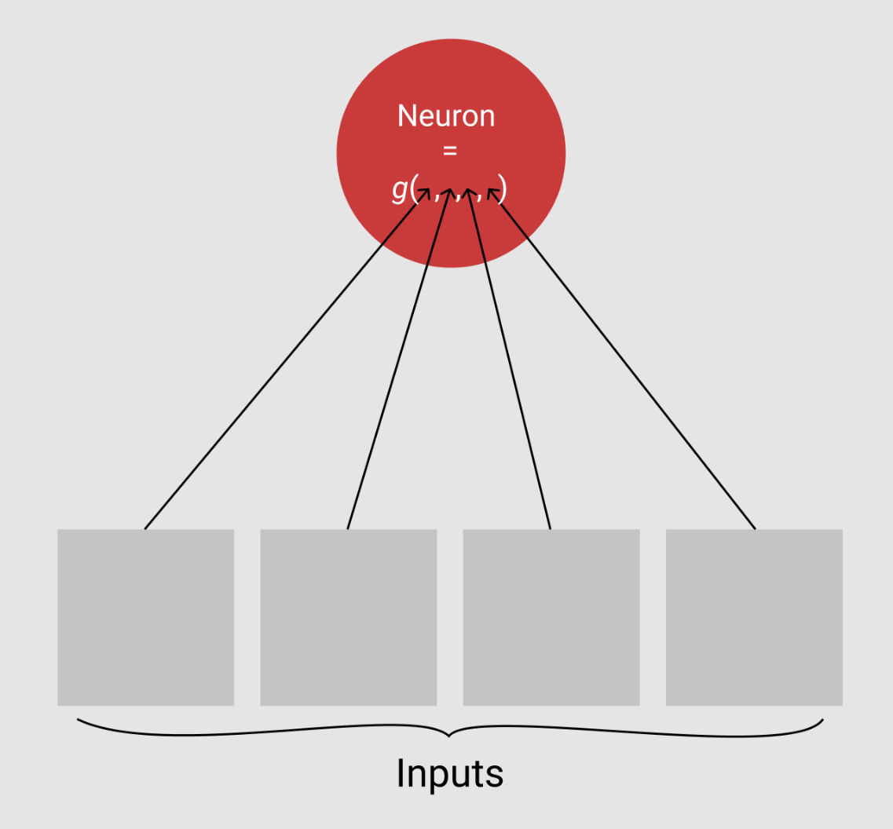
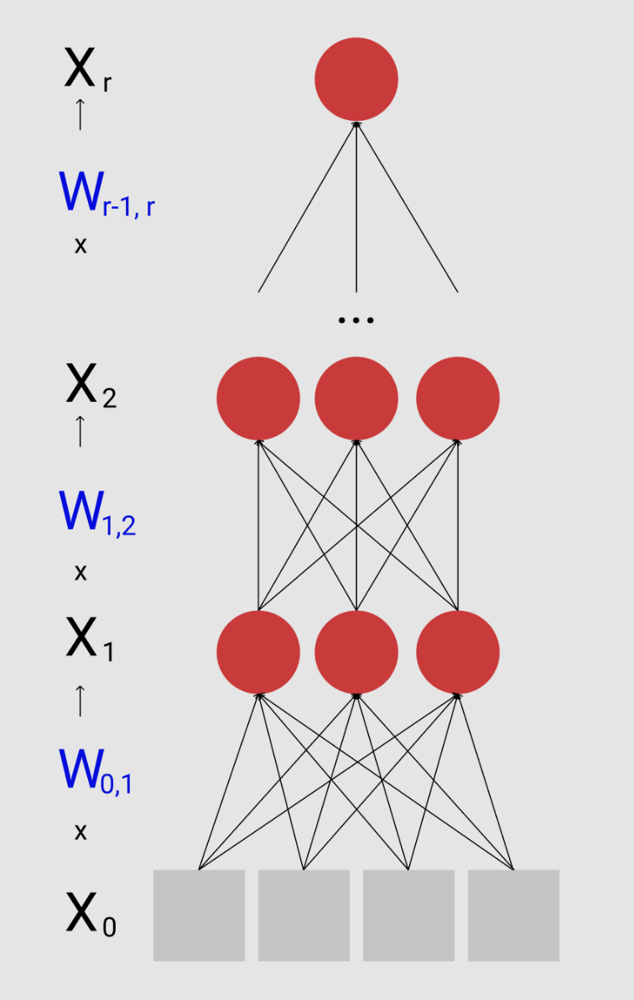

<style>
.small-text{
    font-size: 15px;
    font-style: italic;
}
</style>

```{r setup, include=FALSE}
options(htmltools.dir.version = FALSE)
```

#What we're going to cover

Today we will go over the basics of what a neural net is. This will fall into the following order

- Motivation for neural nets
- Neurons
- Activation functions
- Layers
- Universal approximation theorem
- Training
- An example

---

# Motivation for neural nets

.pull-left[
Task: Fit logistic regression to classify the presence of a cat in a photograph
]
.pull-right[

]


---

## The data


```{r, cache= TRUE}
img <- png::readPNG("data/flumpert_blanket.png")
dim(img)
```

So we just need to setup our logistic regression with `r dim(img)[1]` $\times$ `r dim(img)[2]` $\times$ `r dim(img)[3]` = `r dim(img)[1]*dim(img)[2]*dim(img)[3]` covariates. 

.center[


.small-text[Uh oh, better collect more observations.]
]

---

## Thinking like a statistician

We could however note that there are definitely correlations between two neighboring pixels and lower our fit by using something like a spline... How do we do splines in 4 dimensions?


.pull-left[


.small-text[How do these things even work? [Source](https://en.wiktionary.org/wiki/spline)
]
]
.pull-right[


.small-text[Better hope you can draw a cat well. [Source](https://www.catster.com/lifestyle/kid-cat-drawings)] 
]

Another way we could lower the dimensionality of this would be to scan it for things like a nose or ears and then just make our data a function of those features... Now we have to hard code them. 


---

## An alternative?

Or... we could fit a model that specializes in high-dimensional data that could __automatically learn__ features for us and thus require less data and no laboreous generation of features. 


This is where neural networks shine: 

> The data is very high dimensional and there are correlations within it that can be exploited but manually exploiting them
is hard.

---

class: middle, center

# Nueral network basics

---

# Neurons

The most fundemental unit of a neural network is the 'neuron.'

A neuron is simply an entity thats value is a function of its inputs. 

.center[
 
]

---

## Neurons cont.

What's another example of this format?

...

_Regressions!_

You can simply think of a neuron as a GLM of its inputs.

E.g. $$g(x_1, x_2, x_3, x_4) = \sigma(\beta_0 + \beta_1x_1 + \beta_2x_2 + \beta_3x_3 + \beta_4x_4),$$ where $\sigma(x) = \frac{1}{1 + \exp(-x)}$ is just a logistic regression.


.pull-right[
 
]
---

# Activation Functions


We're not limited to the function of the inputs to a neuron being a sigmoid. We can choose any function we want as long as it maps to a single real number. 

$$g: \mathrel{R}^k \to \mathrel{R^1}$$
For computational convenience (more on this in a second) we constrain this function to having the form of a function composition of a linear combination of inputs and then a 'squashing' or __activation function__. 

$$g(\underline{X}, \underline{\beta}) = f(\underline{X} \underline{\beta}), \text{where } f: \mathrel{R}^1 \to \mathrel{R^1}$$

What this activation function does is totally up to us, but usually it will do something like squash the linear combination to between 0 and 1 or zero out negative values... The only constraint we have is that we want (but don't need) it to be differentiable (more on this in a second).


---
class: center, middle

---

# Layers


.pull-left[

_Okay, so how does this do anything interesting?_

Neural networks take these neurons and arrange them into __layers.__

A layer is a collection of neurons that all take the same inputs.

Where it gets interesting is when we let the inputs to a layer be the results of a previous layer. This is called having a 'hidden' layer. I.e. the layer outputs results to another non-final layer.
]
.pull-right[


]


---

## Layers cont.

So instead of a simple matrix multiplication to get our desired output we compose lots of matrix multiplications.


.pull-left[

Let's let $W_{i,j}$ be the weight matrix governing the linear transformation between layer $i$ and layer $j$. The dimension of $W_{i,j}$ will be $\mathrel{R}^{|L_i|} \times \mathrel{R}^{|L_j|}$ and can be thought of as a bunch of $\beta$ vectors stacked together to return a new vector of the length of the target layer: $|L_j|$. 

$$\begin{aligned}
X_1 &= (X_{0}\cdot W_{0,1})  \otimes f_1 \\
X_2 &= (X_{1}\cdot W_{1,2})  \otimes f_2 \\
... & \\
X_r &= (X_{r-1}\cdot W_{r-1,r})  \otimes f_r \\
\end{aligned}$$
]
.pull-right[

]

---
class: middle

# Universal Approximation Theorem

With a sufficiently large hidden layer, we can approximate any borel-measurable function. 

[Let's see it](https://beta.observablehq.com/@nstrayer/the-universal-approximation-theorem)

---

# Training

So we understand how we can go from our input data to some computed outcome, but how do we make that outcome what we want it to be?

Unfortunately neural network optimization is __not a convex problem__ so we have to use use an approximate iterative technique to attempt to find the global minimum for our cost function. 

Let's start by looking at the cost function. 

.center[
 
]

---

## Cost function

What do we want to optimize?

First we have to think about what our output is: is it a binary variable like a logistic regression? Use what is known in the ML world as "Categorical Cross Entropy" or simply the KLD between your predictions and the emperical distribution of the data. 

$$L(\theta) = -\frac{1}{n}\sum_{i = 1}^n\left[ y_i\log(\hat{y}_i) + (1 - y_i)\log(1 - \hat{y}_i)\right]$$

Doing a regression problems? We can just use mean-squared-error. 

$$\text{MSE}(\theta) = -\frac{1}{n} \sum_{i = 1}^{n} (\hat{y}^{(i)} - y^{(i)})^2$$

In both of these $\theta$ represents all of the weights in our network. 

---
## The gradient

Now that we have a cost function for our model and the actual math in our model in order to optimize we need to calculate the gradient of every weights with respect to that loss function. This sounds daunting but due to a wonderful property of the chain-rule it's actually rather easy. 

$$\frac{dy}{dx_i} = \sum_{j}\frac{dy}{dz_j}\frac{dz_j}{dx_i}$$
_Multivariate chain rule_


Let's think about how we could represent our model as a single function...

$$\hat{y} = g_n \circ g_{n-1} \circ ... \circ g_1(\underline{X})$$

Remember how earlier we stated we wanted our activation functions to be differentiable? If every step in this procedure is differentiable we can apply the chain rule to calculate the derivative of every single parameter.


---

## The gradient visualized

.center[

]

This is called __back propagation.__


The only parameters we are tuning are the weights for the linear transformations: $W_{i,j}$ and the derivative of each weight is only dependent upon the nodes that fall in front of it in the network.

---

# Actually doing it.

We will use the R library `Keras`.

```{r}
library(keras)
```

`Keras` has a helpful function for loading in a classic dataset `MNIST` for demoing models.
```{r, cache = TRUE}
# The data, shuffled and split between train and test sets
c(c(x_train, y_train), c(x_test, y_test)) %<-% dataset_mnist()

# Reshape arrays and transform RGB values into [0,1] range
x_train <- array_reshape(x_train, c(nrow(x_train), 784)) / 255
x_test <- array_reshape(x_test, c(nrow(x_test), 784)) / 255

cat(nrow(x_train), 'train samples\n')
cat(nrow(x_test), 'test samples\n')
```
Comes with lots of data. 

---

Convert our single outcome column to a 1-hot or dummy encoded 10 dimensional vector.

```{r, cache = TRUE}
num_classes <- 10

# Outcomes start as integers...
y_train %>% head()
```


```{r, cache = TRUE}
# Convert class vectors to binary class matrices
# to_categorical is a helper keras function for doing this. 
y_train <- to_categorical(y_train, num_classes)
y_test <- to_categorical(y_test, num_classes)

# And end as a matrix.
y_train %>% head()
```

---

## Setting up the model

We're going to have two hidden layers, one with 256 neurons and the other with 128. Since we have ten classes our last layer has ten neurons each corresponding to a given class. 

```{r, eval = FALSE}
# Define Model --------------------------------------------------------------
model <- keras_model_sequential()
model %>% 
  layer_dense(units=256, activation='relu', input_shape=c(784)) %>% 
  layer_dense(units=128, activation='relu') %>%
  layer_dense(units=10,  activation='softmax')

# Compile model with correct loss and optimization type
model %>% compile(
  loss = 'categorical_crossentropy',
  optimizer = optimizer_rmsprop(),
  metrics = c('accuracy')
)
```

---

## Training it

Now we can let the model train!

.pull-left[

```{r,eval = FALSE}
# Fit model to data
history <- model %>% fit(
  x_train, y_train,
  batch_size = 128,
  epochs = 7,
  verbose = 1,
  validation_split = 0.2
)
```

98% test accuracy, not too bad. We did overfit, however, how can we fix this?

]

.pull-right[
```{r, echo = FALSE}
history <- readRDS('history.rds')
plot(history)
```
]

