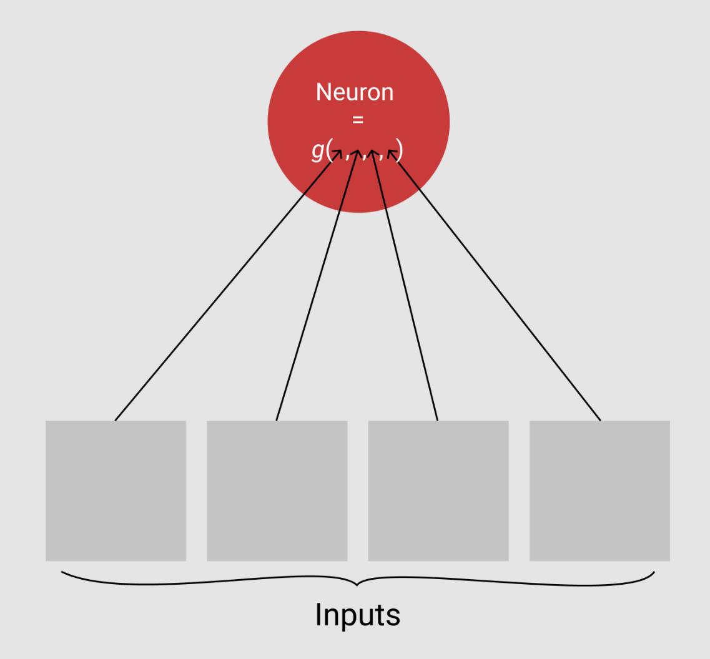

```{r setup, include=FALSE}
options(htmltools.dir.version = FALSE)
```

# Outline

- Recap
- Regularization
  - L1 and L2
  - Dropout
- Architectures
  - Convolutional 
- Spell casting Demo

---

# Recap of last lecture

We rushed over: 

- What a neuron is.
- How neurons are assembled to make a 'layer'
- How we train the network with gradient descent.

---
## What's a Neuron?

Simply a linear combination of its inputs that are then squashed by some __activation function.__ 

Essentially just a GLM.

.center[
 
]
---
```{r, cache = TRUE, fig.height = 4, fig.align = 'center', fig.width = 9}
library(tidyverse)

expand.grid(x1 = seq(-1,1, length.out = 100), x2 = seq(-1,1, length.out = 100))%>%
  mutate(
    linear = 0.2 + x1*0.4 + x2*-1.5,
    final = ifelse(linear > 0, linear, 0)
  ) %>% 
  gather(stage, value, -x1, -x2 ) %>% 
  ggplot(aes(x = x1, y = x2, fill = value)) +
  geom_raster() +
  scale_fill_gradient2(low = 'orangered', mid = 'white', high = 'steelblue') +
  facet_grid(.~stage)
```

---
## Layers of Neurons

.pull-left[
What makes neural networks special is that we don't just use one neuron, we stack together a bunch of them into what is called a __layer.__

These layers can then act as input to new layers, allowing the network to learn complex and hierarchical patterns in the data without any prespecification. 

]
.pull-right[

]

---
## Geometric intuition

.center[

]


---

# Regularization

We can do regularization just like we do in normal linear models: with the L1 (Ridge) and L2 (Lasso) penalization types, or the L1 + L2 (Elastic net)

However, Neural nets have a particularly interested form of regularization known as Dropout. 

---

## Dropout

When training a model with dropout any given neuron in the hidden layers can randomly be 'dropped' from the network.

This means that its value is set to zero regardless of its inputs. The model is then trained just like that neuron never existed. 

Intuitively this helps to network learn alternative paths to a solution, rather than overfitting on some particular bias in the training set. 

E.g. Identifying a photo of a house could be overfit by every house photo having a blue sky in the background. Dropout would sometimes force the network to learn without it's 'blue sky' neuron, making it more likely to look for other features. 

---

## Redoing the model from before with dropout.

```{r, eval = FALSE, echo = FALSE}
library(keras)
# The data, shuffled and split between train and test sets
c(c(x_train, y_train), c(x_test, y_test)) %<-% dataset_mnist()

x_train <- array_reshape(x_train, c(nrow(x_train), 784))
x_test <- array_reshape(x_test, c(nrow(x_test), 784))
x_train <- x_train / 255 # Transform RGB values into [0,1] range
x_test <- x_test / 255
cat(nrow(x_train), 'train samples\n')
cat(nrow(x_test), 'test samples\n')

num_classes <- 10
# Convert class vectors to binary class matrices
y_train <- to_categorical(y_train, num_classes)
y_test <- to_categorical(y_test, num_classes)

# Define Model --------------------------------------------------------------
model <- keras_model_sequential()
model %>% 
  layer_dense(units = 256, activation = 'relu', input_shape = c(784)) %>% 
  layer_dropout(rate = 0.4) %>% 
  layer_dense(units = 128, activation = 'relu') %>%
  layer_dropout(rate = 0.4) %>% 
  layer_dense(units = 10, activation = 'softmax')


model %>% compile(
  loss = 'categorical_crossentropy',
  optimizer = optimizer_rmsprop(),
  metrics = c('accuracy')
)

# Fit model to data
history <- model %>% fit(
  x_train, y_train,
  batch_size = 128,
  epochs = 7,
  verbose = 1,
  validation_split = 0.2
)

#saveRDS(history, 'history_w_dropout.rds')
```

```{r, eval = FALSE}
model <- keras_model_sequential()
model %>% 
  layer_dense(units = 256, activation = 'relu', input_shape = c(784)) %>% 
* layer_dropout(rate = 0.4) %>% 
  layer_dense(units = 128, activation = 'relu') %>%
* layer_dropout(rate = 0.4) %>% 
  layer_dense(units = 10, activation = 'softmax')

```

```{r, echo = FALSE, fig.height = 4, fig.width = 9, fig.align = 'center'}
library(keras)
history <- readRDS('history_w_dropout.rds')
plot(history)
```

No more overfitting!
---

# Moving beyond full-connected networks

While these networks are powerful and the degrees of freedom issue is not clear-cut, there are still a lot of parameters.

Some alternative 'architectures' have been proposed to deal with this by sharing the weights for different parts of the model in intelegent ways. 


---

# The Convolutional Network

The convolutional neural network exploits spatial correlation in data by constructing feature detectors that slide over the spatial dimensions.

This effectively gives an indicator of if a given feature was seen in a given region of the data. 

Originally developed for use in time-series data, but now primarily used in computer vision. 


---
# Some terms

- __Stride__: How many units your detector moves each step. 1 = output is same size as input. 
- __Padding__: How do you deal with the edges? You can pad them with zeros or simply start your detector from the edge.
- __Kernel size__: How big an edge of your detector is. 
- __Pooling__: The act of taking the output of your detector scanned over the data and pooling it to something like the max or the average.
    - Good for reducing dimension and giving the model the ability to be robust to shifts in the features. 

---
class:center


---
class: center, middle
## A better demo than I can give


[Convolution Visualizer](https://ezyang.github.io/convolution-visualizer/index.html)
---
class: middle
# Demo on accelerometer data. 

It's fun to recreate the same demos that everyone has done a million times but let's see a convolutional neural network done on real data. 

---

## The Model

.pull-left[
  __Input__: Data is three directions over a spatial (time) dimension. 
  
  __Desired Output__: A classification of what spell was cast in a two second recording interval.
  
  __Model__: Convolutional neural network with a _max pooling_ layer that feeds to a single dense layer. 
  
]
.pull-right[
.center[


]
]

---

# The Recurrent Network

Shares weights by passing data through exact same network at each successive step in the data. 

.center[

]

More info: [nickstrayer.me/qualifying_exam/architectures.html#recurrent-neural-networks](http://nickstrayer.me/qualifying_exam/architectures.html#recurrent-neural-networks)
